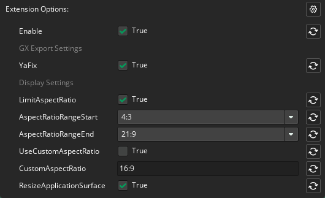
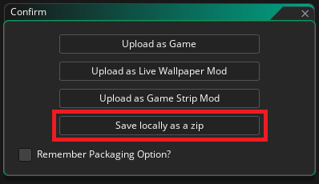

# NOGX
It's an extension for **Game Maker** that removes **GX platform** bindings in **GX target**.
Simply, it's just replacing the `index.html` file, but it also does other useful things.

> Tested only on runtime v2024.14.2.256

> This extension can be useful even if you are not going to use GX target.

### 1. Replacing `index.html` in GX target
The extension replaces the html file with its own `index.html`, which excludes bindings and functionality for the GX platform.
> The extension repackages the zip archive created for GX target.

### 2. `webfiles` folder
This is a special folder in the root directory of your project where you can place web files.
The extension will include them in the **GX target** builds.
You can also use your custom `index.html` file located here, but it should be based on the default `index.html` file from the extension.

### 3. Screen size control (works in other targets, not just GX)
The extension manages the screen size within the specified aspect ratio constraints and also prevents image blur, even in an HTML5 target.

## Extension Options


## Functions
```gml
NOGX_get_canvas_width();
NOGX_get_canvas_height();
```

## How to use
1. Add the extension to your project.
2. Set the extension settings you need.
3. Use `NOGX_get_canvas_width` and `NOGX_get_canvas_height` functions when controlling the size of the viewport and GUI size in your game.
4. When exporting the GX target game select the `Save locally as zip` option.   


